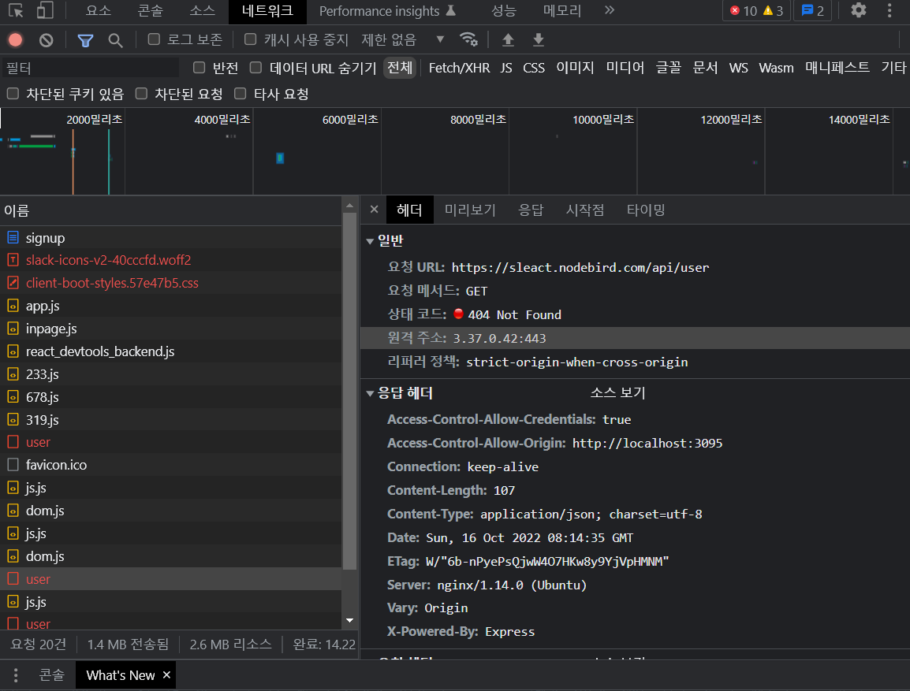

# SLEACT 타임어택 1기

## 프론트엔드 초기 세팅하기(CRA X)

### 1. package.json 생성

```bash
// package.json 생성 명령어
npm init

```

- package name 은 npm package와 동일한데, 만약 동일한 패키지를 설치하게 되면 에러가 발생한다.

### 2. eslint 및 prettier 설치

- eslint 코드 검사 도구 : 안쓰는 변수나 문법 검사한다.
- prettier: 코드 자동 정렬 도구 -> 협업 과정에서 중립적인 역할을 한다.
- 확장자가 없으면서(json 혹은 js으로 확장자가 있는 경우도 있음) `.` 으로 시작하는 파일들은 설정파일들로, 다 숨김 파일로 처리된다.
  - ex) `.prettierrc`

### 3. tsconfig,json 설정

- 타입스크립트는 결국 자바스크립트로 바뀌는데, tsconfig.json을 기반으로 하여 자바스크립트로 바뀐다.
- 각 속성 설명

  ```json
  {
    "compilerOptions": {
      // 원래는 node modules 가 import * as React from "react"; 형태로 임포트하는데,
      // esModuleInterop을 true로 하면 import React from "react"; 형태로 임포트할 수 있음
      "esModuleInterop": true,
      // sourceMap : 코드가 에러났을 때, 에러가 난 원래 파일 소스로 갈 수 있는 속성
      "sourceMap": true,
      // 최신 자바스크립트 문법과 dom을 라이브러리로 쓴다는 속성
      "lib": ["ES2020", "DOM"],
      // react jsx로 쓴다는 속성
      "jsx": "react",
      // module을 최신 모듈로 쓴다는 속성
      "module": "esnext",
      // import를 노드가 해석할 수 있도록 하겠다
      "moduleResolution": "Node",
      // 소스코드를 es2020으로 작성하더라도 es5로 변환하겠다
      "target": "es5",
      // 타입 체킹을 엄격히 하겠다
      "strict": true,
      // import json을 허락하겠다
      "resolveJsonModule": true,
      // 절대경로처럼 import 할 수 있는 설정
      "baseUrl": ".",
      "paths": {
        "@hooks/*": ["hooks/*"],
        "@components/*": ["components/*"],
        "@layouts/*": ["layouts/*"],
        "@pages/*": ["pages/*"],
        "@utils/*": ["utils/*"],
        "@typings/*": ["typings/*"]
      }
    },
    "ts-node": {
      "compilerOptions": {
        "module": "commonjs",
        "moduleResolution": "Node",
        "target": "es5",
        "esModuleInterop": true
      }
    }
  }
  ```

### 4. babel 설정

- babel 설정에 쓰이는 패키지들을 설치하고, 웹팩 파일에서 설정한다.
  - `HTML`, `CSS`, `JavaScript` 들의 단점들을 보완하고자 추가 설정된다.

```bash
npm i -D webpack @babel/core babel-loader @babel/preset-env @babel/preset-react
// 타입스크립트의 경우: 타이핑 추가
npm i -D @types/webpack @types/node babel/preset-typescript style-loader css-loader
```

- **결국에 브라우저는 `HTML`, `CSS`, `JavaScript`를 인식하기 때문에, SCSS나 타입스크립트 등이 변환되어야한다.**
  - 그래서 타입스크립트가 바벨을 거쳐 자바스크립트로 변환하는 작업을 처리한다.
- 설정 설명

```typescript
import path from "path";
import ReactRefreshWebpackPlugin from "@pmmmwh/react-refresh-webpack-plugin";
import webpack, { Configuration as WebpackConfiguration } from "webpack";
import { Configuration as WebpackDevServerConfiguration } from "webpack-dev-server";

interface Configuration extends WebpackConfiguration {
  devServer?: WebpackDevServerConfiguration;
}

import ForkTsCheckerWebpackPlugin from "fork-ts-checker-webpack-plugin";

const isDevelopment = process.env.NODE_ENV !== "production";

const config: Configuration = {
  name: "sleact",
  mode: isDevelopment ? "development" : "production",
  devtool: !isDevelopment ? "hidden-source-map" : "eval",
  resolve: {
    // 바벨이 처리할 확장자 목록
    extensions: [".js", ".jsx", ".ts", ".tsx", ".json"],
    // tsconfig와 wepack 둘 다 절대경로 설정을 해줘야함
    // tsconfig는 소스 코드를 올바르게 썼는지를  tsconfig를 기반으로 검사해주고(타입스크립트 검사기)
    // webpack은 alias를 기반으로 자바스크립트로 바꿔주기 때문
    alias: {
      "@hooks": path.resolve(__dirname, "hooks"),
      "@components": path.resolve(__dirname, "components"),
      "@layouts": path.resolve(__dirname, "layouts"),
      "@pages": path.resolve(__dirname, "pages"),
      "@utils": path.resolve(__dirname, "utils"),
      "@typings": path.resolve(__dirname, "typings"),
    },
  },
  // entry는 여러개일 수도 있다.
  entry: {
    app: "./client",
    // app2: './client'
  },
  module: {
    rules: [
      {
        test: /\.tsx?$/,
        // babel-loader 가 ts, tsx를 자바스크립트로 바꾸어준다
        loader: "babel-loader",
        options: {
          presets: [
            [
              "@babel/preset-env",
              {
                // 타겟 브라우저에 돌아갈 수 있도록 자바스크립트 문법을 변환해준다
                targets: { browsers: ["IE 10"] },
                debug: isDevelopment,
              },
            ],
            "@babel/preset-react",
            "@babel/preset-typescript",
          ],
          env: {
            development: {
              plugins: [require.resolve("react-refresh/babel")],
            },
          },
        },
        exclude: path.join(__dirname, "node_modules"),
      },
      {
        test: /\.css?$/,
        // css 파일을 자바스크립트로 변환해준다
        use: ["style-loader", "css-loader"],
      },
    ],
  },
  plugins: [
    new ForkTsCheckerWebpackPlugin({
      async: false,
      // eslint: {
      //   files: "./src/**/*",
      // },
    }),
    // 리액트에서 NODE_ENV라는 변수를 사용할 수 있게 해준다(원래는 NODE_ENV는 백엔드나 Node runtime에서만 사용 가능)
    new webpack.EnvironmentPlugin({
      NODE_ENV: isDevelopment ? "development" : "production",
    }),
  ],
  output: {
    // __dirname -> alecture
    path: path.join(__dirname, "dist"),
    // name 은 entry 에서 지정한 값들이 들어간다
    // wepack이 app.js, app2.js 등으로 나오게 됨
    filename: "[name].js",
    publicPath: "/dist/",
  },
  devServer: {
    historyApiFallback: true, // react router
    port: 3090,
    devMiddleware: { publicPath: "/dist/" },
    static: { directory: path.resolve(__dirname) },
  },
};

// 개발 환경일 때 쓸 플러그인들
if (isDevelopment && config.plugins) {
  config.plugins.push(new webpack.HotModuleReplacementPlugin());
  config.plugins.push(new ReactRefreshWebpackPlugin());
}
// 배포환경일 때 쓸 플러그인들
if (!isDevelopment && config.plugins) {
}

export default config;
```

### 5. index.html 생성

- webpack에서 `CSS`와`JS`를 처리했으니, index.html로 `HTML`을 처리한다.

- id가 "app"인 태그에 jsx로 만든 태그들이 들어간다.
- 즉, ` <script src="/dist/app.js"></script>` 가 ` <div id="app"></div>` 을 채워넣는다.

---

## 로그인, 회원가입 만들기

### 1. 커스텀 훅 만들기

### 2. axios로 요청 보내기와 CORS, proxy

```typescript
// pages/SignUp/index.tsx

...
const onSubmit = useCallback(
    (e) => {
      e.preventDefault();
      if (!mismatchError && nickname) {
        console.log('서버로 회원가입하기');
        // 비동기 로직에서 setState 등 값을 바꾸려고 할 때, 무조건
        // 해당 함수를 초기화하고 값을 갱신해라
        // 그렇지 않으면, 2회 이상 연속 비동기 요청 보내는 상황 등이
        // 왔을 때, 1번째 요청때 담아놨던 결과가 2번째 요청때 그대로
        // 담겨있는 현상이 생기기 때문
        // 즉 요청 보내기 이전의 결과가 담아있을 수 있기 때문에
        // 초기화 후, 요청을 받아오자
        axios
          // proxy를 설정했기 때문에 앞의 호스트명과 포트번호를 안적어도됨
          .post('api/users', {
            email,
            nickname,
            password,
          })
          .then((res) => {
            setSignUpSuccess(true);
          })
          .catch((error) => {
            setSignUpError(error.response.data);
          });
      }
    },
    [email, nickname, password, mismatchError],
  );
...
```

### 3. swr 사용하기(+쿠키 공유하기)

swr은 다른 탭에 갔다가 오면, API에 재요청을 보내 데이터를 갱신한다.

#### 쿠키

- 프론트엔드와 백엔드 서버가 다르면 백엔드에서 프론트엔드로 쿠키를 생성해줄 수 없고, 프론트엔드에서 백엔드로 쿠키를 보내줄 수 없다.
- 이를 위해 **withCredentials : true** 를 설정하여 백엔드에서 쿠키를 생성하여 프론트엔드가 쿠키를 받아 백엔드에 주고 인증을 받는다.
- GET요청에서는 2번째 자리, POST요청에서는 3번째 자리에 설정한다.

#### 왜 변수 사용을 let이 아닌 useState로 할까?

- let으로 변수를 선언 후, 특정 조건에서 값을 바꾸는 로직을 작성한다고 가정해보자
- 그러나 다른 렌더링을 유발하는 이벤트로 인해, 해당 컴포넌트가 다시 실행되고, 이에 따라 변수가 다시 선언되어 true가 되기 때문에 useState를 쓴다.

```javascript
...
let value = true;

const onChange = (e) => {
  // 이렇게 값을 바꾸어도 리렌더링 됐을 때, value는 true 다시 바뀜
  value = false;
}

return (
  <div>
  <input onChange={onChange} value={name}/>
  </div>
)
```

#### swr revalidate

swr이 제공하는 기능 중, **revalidate**라는 기능이 있다.

**revalidate**는 주기적으로 서버에 호출하는 기능이며, **dedupingInterval** 기간 내에는 캐시에서 데이터를 불러온다.

---

## 에러 처리

### MYSQL 관련 에러

```bash
Emitted 'error' event on Server instance at:
    at emitErrorNT (node:net:1361:8)
    at processTicksAndRejections
(node:internal/process/task_queues:83:21) {
  code: 'EADDRINUSE',
  errno: -4091,
  syscall: 'listen',
  address: '::',
  port: 3095
}
[nodemon] app crashed - waiting for file changes before starting..
```

실수로 npm install을 했었던 상황에서 yarn start를 한 이유인지, 다음과 같은 에러 충돌이 발생하였다.

1. node modules 삭제 -> 실패
2. 알고보니, MYSQL CONNECTION이 끊어져 있었음
   - MYSQL을 지우고, 새로 DB를 생성함 (해결 완료)

### 회원가입 관련 요청이 다른 API로 보내지는 현상

```
api/users로 요청이 보내져야하는데, 계속 https://sleact.nodebird.com/api/user 로 요청이 보내져 404 에러가 반환되는 현상이 발생했다.
에러 사진은 하단과 같다.
```



- 확인한 방법들은 다음과 같다.

  - api url 을 확인하다 => 옳게 작성하였다.

  - package-lock.json 과 node_modules를 프론트 및 백엔드 폴더에서 삭제 후, 재설치를 시도해았다.

  - backend 및 frontend 재초기 세팅
  
    - 여기서 db 연결 후,`npx sequelize db:seed:all` 를 했을 때,  다음과 같은 에러가 발생했다.
  
      - 유추한건데, 마이그레이션 과정에서 에러가 발생한 것으로 판단하여 MYSQL workspace를 삭제 및 다시 세팅하였으나, 해결되지 않았다.
  
      ```bash
      Loaded configuration file "config\config.js". Using environment "development". == 20201019065847-sleact: migrating ======= ERROR: Validation error
      ```
  
      - 결국, config.js에서 DB이름을 sleact -> sleact2로 변경후, 다시 create && sequelize 명령을 통해 세팅을 마쳤다.
